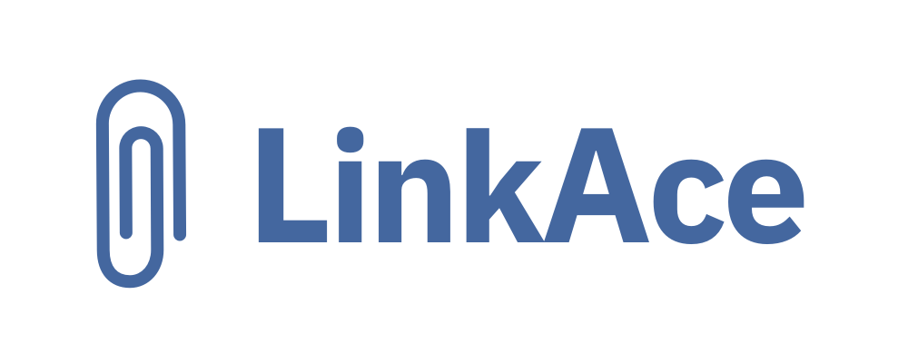

<p align="center">
  
</p>

<p>&nbsp;</p>

<p align="center"><b>Your selfhosted bookmark archive with a simple interface and advanced features.</b></p>
<p align="center"><b>:warning: This application is still in development! :warning:</b></p>

<p align="center">
  <a href="https://twitter.com/LinkAceApp"></a>
  <a href="https://hub.docker.com/r/linkace/linkace"></a>
  <a href="https://github.com/Kovah/LinkAce/releases"></a>
  <a href="https://opensource.org/licenses/MIT"></a>
  <a href="https://crowdin.com/project/linkace"></a>
</p>
<p>&nbsp;</p>


### Contents

* [About LinkAce](#about-linkace)
* [Support Disclaimer](#bulb-support-for-linkace)
* [Setup](#gear-setup)
  * [Setup with Docker](#setup-with-docker)
  * [Setup without Docker](#setup-without-docker)
* [Contribution](#construction-contribution)
  * [Development](#development)


---


### About LinkAce


LinkAce is a bookmark manager similar to Shaarli and other tools. I built this tool to have something that fits my
actual needs which other bookmark managers couldn't solve, even if most features are almost the same.

#### Features

* Save links with automatic title and description generation.
* Automated link checks to make sure your bookmarks stay available.
* Automated “backups” of your bookmarks via the Waybackmachine.
* Organize bookmarks in lists and tags.
* A bookmarklet to quickly save links from any browser.
* Private or public links, so friends or internet strangers can see your collection.
* Add notes to links to add thoughts or other information.
* Advanced search including different filters and ordering.
* Import existing bookmarks from HTML exports (other methods planned).
* Support for complete database and app backups to Amazon AWS S3.
* A built-in light and dark color scheme.

More features are already planned. Take a look at the [project board](https://github.com/Kovah/LinkAce/projects/1)
for more information.

#### Documentation and Community

Any further information about all the available features and how to install the app, can be found on the 
[LinkAce Website](https://www.linkace.org/). Additionally, you may visit the [community forums](https://spectrum.chat/linkace/)
to share your ideas, talk with other users or find help for specific problems.


---


### :bulb: Support for LinkAce

Free support is highly limited for all my free tools, including LinkAce. If you need help please visit the 
[community forum](https://spectrum.chat/linkace/) and post your issue there. I do not offer free personal 
support via chat or email.
Please notice that LinkAce has specific requirements to run correctly.

If you need prioritized support you can **become a [Patreon](https://www.patreon.com/Kovah)** 
or **[Github Sponsor](https://github.com/sponsors/Kovah)**. :star:


---


### :gear: Setup

Please check if your server supports the [requirements](https://www.linkace.org/docs/v1/setup/) before starting the
setup.

#### Setup with Docker

Working with Docker is pretty straight forward. The image available on Docker Hub contains the application code, any
precompiled assets as well as PHP installed. This means you can use any web server you want, any cache driver you want
and any database system you want.

To make things easier, we provide a Docker Compose file (docker-compose.production.yml) in the repository which
contains all needed services, perfectly configured to run the application right away.

#### 1. Copy all needed files

All files you need are `docker-compose.production.yml`, `.env.docker` and `nginx.conf`. Copy both to the directory you
want to use for the application.

#### 2. Modify the .env.docker file

Make a copy of the `.env.docker` file and name it `.env`. By default, you only must change two variables set in this 
file before starting the setup:

* DB_PASSWORD - Please set a secure password here
* REDIS_PASSWORD - Please set a secure password here

#### 3. Modify the nginx.conf file (optional)

This step is optional but may depend on your setup. You probably want to run the app standalon on a server. For this I
highly recommend providing SSL certificates ([Let's Encrypt](https://letsencrypt.org/)) and change the `nginx.conf` as 
well as the `docker-compose.production.yml` file:

* In `nginx.conf`: replace `listen 0.0.0.0:8085` with `listen 0.0.0.0:8085 ssl;`
* In `nginx.conf`: uncomment the lines beginning with `ssl_certificate` and change the certificate file names
* In `docker-compose.production.yml`: replace `"127.0.0.1:80:8085"` with `"127.0.0.1:443:8085"`.
* In `docker-compose.production.yml`: uncommend the `/path/to/ssl/certificates:/bitnami/nginx/conf/bitnami/certs` line 
  and set the correct path to your certificates before the colon.

#### 4. Run the application

After you completed the above steps, run the following command to start up the container setup:

```bash
docker-compose up -d
```

#### 5. Run the Setup

After you started the Docker containers, you are almost ready to run the setup. Before the setup, we have to generate
a secret key.
Please note that `linkace_php_1` is the name of your PHP container here. It may differ from your name. You will find
the name of your container in the output of the previous command, but will most likely end with `_php_1`.

```bash
docker-compose run php php artisan key:generate
```

Open the URL which points to your Docker container in your browser now. You have to configure the database, and your 
user account in this process.

Please make sure to follow the post-installation tasks to fully enable all features. A guide can be found in the 
[wiki](https://www.linkace.org/docs/v1/setup/post-setup).


#### Setup without Docker

The application was developed with being used with Docker in mind. If you don't want to or if you can't use Docker,
you can also run LinkAce as a regular PHP application. Please notice that there won't be any support for custom 
environments, unsupported PHP versions or help with setting up Apache or your nginx proxy.

Please note that you **must have shell access to your server**. A shared hosting may not be suitable for this.

Follow the instructions in the [wiki](https://www.linkace.org/docs/v1/setup/setup-without-docker) to install 
LinkAce without Docker.


---


### :construction: Contribution

If you want to contribute to the project please open a [ticket](https://github.com/Kovah/LinkAce/issues) first and 
describe what you want to do or what your idea is. Maybe there already is an existing ticket for your or a very similar 
topic.

I may decline contributions for features that may not fit into the application.

#### Some Contribution Guidelines

* Always use the `dev` branch to work on the application. The dev branch will contain the latest version of the app
while the `master` branch may contains the stable version (which may be outdated in terms of development).
* Consider using a separate branch if you are working on a larger feature.
* When opening a pull request, link to your ticket and describe what you did to solve the problem.


### Development

#### Requirements

* [Docker](https://www.docker.com/products/docker-desktop)
* [Node](https://nodejs.org/en/) (12 LTS)

#### 1. Basic Setup

Simply clone the repository to your machine and run the following command to build the container setup:

```bash
docker-compose up -d --build
```

Now, install all dependencies from inside the PHP container:

```bash
docker exec linkace-php bash -c "composer install"
```

Last step: compile all assets. Node 10 LTS is the minimum version required and recommended to use.
You may use either NPM or Yarn for installing the asset dependencies.

```bash
npm install
OR
yarn install

npm run dev
```

#### 2. Working with the Artisan command line

I recommend using the Artisan command line tool in the PHP container only, to make sure that the same environment is 
used. To do so, use the following example command:

```bash
docker exec linkace-php bash -c "php artisan migrate"
```

#### 3. Registering a new user

Currently, you can do this by using the command line:

```bash
docker exec -it linkace-php bash -c "php artisan registeruser [user name] [user email]"
```


#### Tests

You can run existing tests with the following command:

```bash
docker exec -it linkace-php composer run tests
```


---


LinkAce is a project by [Kovah](https://kovah.de) | [Contributors](https://github.com/Kovah/LinkAce/graphs/contributors)
